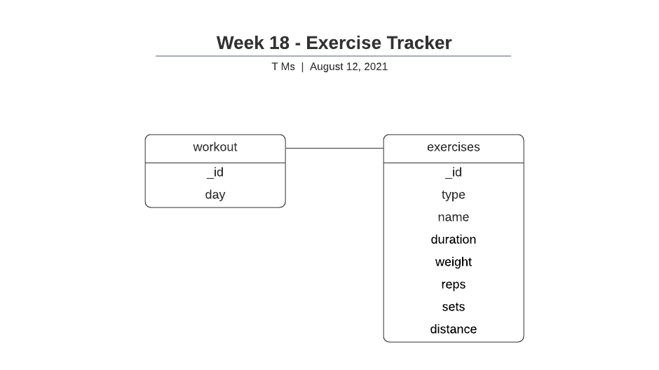
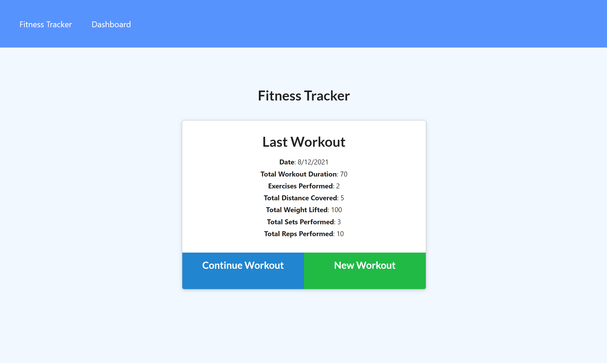
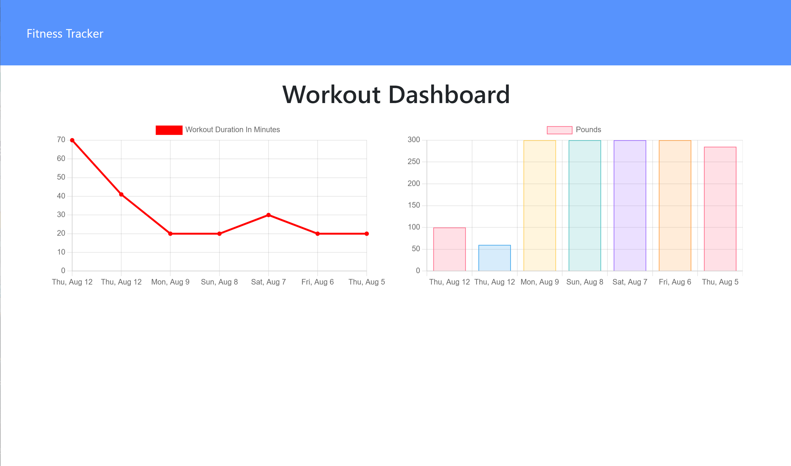
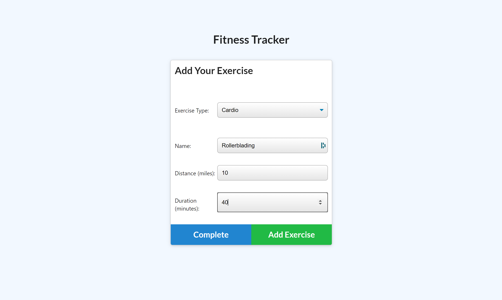

# Week18-WorkoutTracker

## Description

This is a workout tracker to help the consumer reach their fitness goals more quickly. 

Users can:

- View and track daily workouts.
- Log multiple exercises in a workout on a given day.
- Track the name, type, weight, sets, reps, and duration of an exercise.
- For cardio, track distance traveled.

## Link to App

https://frozen-meadow-30451.herokuapp.com/

## Acceptance Criteria

- Add exercises to the most recent workout plan.
- Add new exercises a new workout plan.
- View combined weight of multiple exercises from the past seven workouts on the dashboard.
- View the total duration of each workout from the past seven workouts on the dashboard.

## Database design

## Screens

---